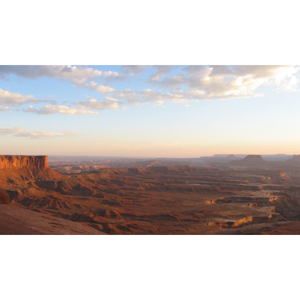

<picture style="float: right; clear: none;">
  
</picture>

## Disclaimer Information

The documents contained here were acquired from US Government sources.
These files were, as far as can be determined, produced by the US Government
and are therefore not subject to US Copyright.

## Directories

<div style="clear: both"></div>

* `pdf-samples` - A directory of short, real-world PDF files
  from which images can be extracted using pdfimages like so:
  ```commandline
  OLDIFS="$IFS"; { IFS=$(echo -en "\n\b"); for file in $(find pdf-samples -iname '*.pdf'); do dir=$(echo "$file" | perl -ple 's/\.pdf$//i; s/^\s+//; s/\s+$//; s/\//__/g'); echo "$dir"; mkdir "tbd/$dir"; (cd "tbd/$dir"; pdfimages -tiff -png ../../"$file" "$dir") ; done }; IFS="$OLDIFS"
  ```
  after which we can process these extracted images with `process-training-images` like so:
  ```commandline
  process-training-images -t -a -k -q 0.75 -C USWebCoatedSWOP.icc -v -o image-samples tbd
  ```
  breaking down that command:
  * `-t` - Do not add a background to transparent sections of images
  * `-a` - Process all images, not just those with a mask
  * `-k` - Keep existing images if run multiple times
  * `-q 0.75` - Only process images that are at least 75% of the target width or height
  * `-C USWebCoatedSWOP.icc` - Use the standard Adobe "web coated" colorspace map for CMYK images<sup>1</sup>
  * `-v` - Verbose output
  * `-o image-samples` - The directory to store the resulting images in
* `image-samples` - The - pre-extracted images from the PDFs in `pdf-samples`.

----
<sup>1</sup> The color profile file referenced here must be
  [downloaded from Adobe's site](https://www.adobe.com/support/downloads/iccprofiles/iccprofiles_win.html).
  Colormaps will only apply to images that don't provide their own.

<picture>
  
</picture>
